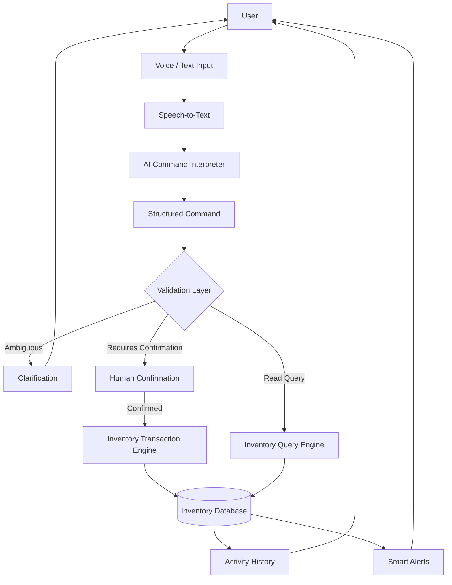
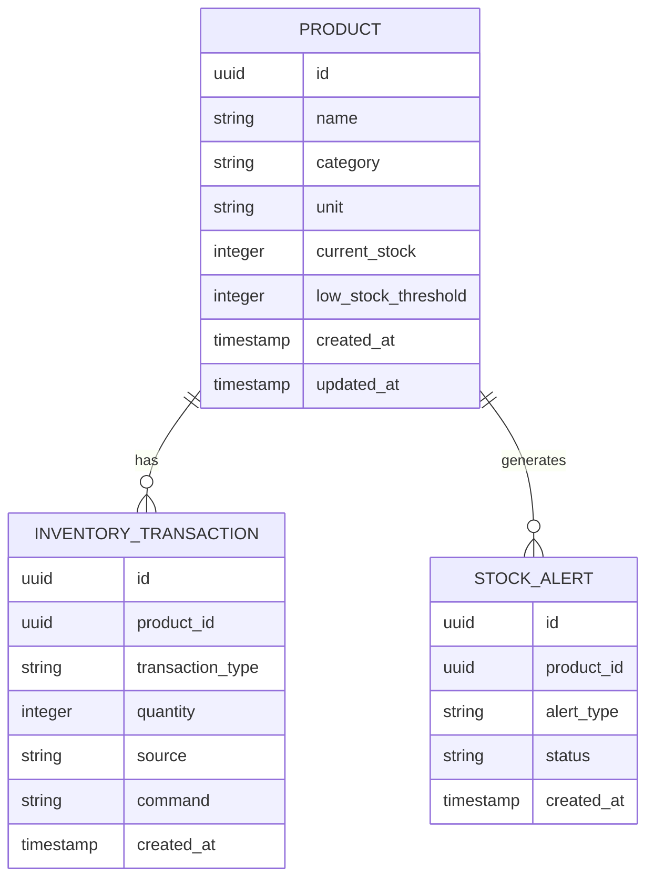
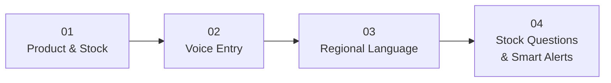

# 🎙️ VoiceMate

<p align="center">
  <strong>Voice-first inventory management for real-world operations.</strong>
</p>

<p align="center">
  Speak naturally. Let AI understand. Confirm the action. Update inventory.
</p>

<p align="center">
  
  
  
  
  
  
</p>

---

## 🚀 What is VoiceMate?

**VoiceMate** is a voice-first inventory management application designed to reduce the friction of traditional stock management.

Instead of navigating forms, searching tables, and manually entering every stock movement, an operator can simply say:

> **"Add 20 notebooks."**

or

> **"How many printer papers are left?"**

VoiceMate is designed to understand the request, convert it into a structured command, validate it, request confirmation when required, and execute the appropriate inventory operation.

The goal is simple:

### **Make inventory management feel like a conversation — not a spreadsheet.**

---

## 🎯 The Problem

Traditional inventory systems often force operators through repetitive workflows:

```text
Find Product
     ↓
Open Form
     ↓
Select Transaction
     ↓
Enter Quantity
     ↓
Submit
     ↓
Repeat
```

This becomes inefficient for people working with physical inventory, especially when their hands are occupied, when transactions happen frequently, or when typing is not the most natural interaction method.

VoiceMate changes the interaction model:

```text
                 ┌──────────────┐
                 │    SPEAK     │
                 └──────┬───────┘
                        ↓
                 ┌──────────────┐
                 │  UNDERSTAND  │
                 └──────┬───────┘
                        ↓
                 ┌──────────────┐
                 │   VALIDATE   │
                 └──────┬───────┘
                        ↓
                 ┌──────────────┐
                 │   CONFIRM    │
                 └──────┬───────┘
                        ↓
                 ┌──────────────┐
                 │    UPDATE    │
                 └──────┬───────┘
                        ↓
                 ┌──────────────┐
                 │    RECORD    │
                 └──────────────┘
```

---

# 🧠 The Core Idea

VoiceMate is **not an LLM directly connected to an inventory database**.

Instead, AI acts as an interpretation layer.

```text
User Speech
     ↓
Speech-to-Text
     ↓
AI Interpretation
     ↓
Structured Command
     ↓
Validation
     ↓
Human Confirmation
     ↓
Transaction Engine
     ↓
Inventory Database
```

### The fundamental rule:

> **AI interprets. Application validates. Database stores.**

This separation is one of the most important architectural decisions in VoiceMate.

The LLM never becomes the source of truth for inventory.

---

# 🏗️ Technical Design & Solution Architecture



---

# 🔄 Example: From Voice to Inventory

### User

```text
"Add 30 notebooks."
```

### AI interpretation

```json
{
  "intent": "STOCK_IN",
  "product": {
    "name": "Notebook"
  },
  "quantity": 30,
  "unit": "piece",
  "requiresConfirmation": true
}
```

### Validation

```text
Product exists?       ✓
Quantity valid?       ✓
Unit valid?           ✓
Operation valid?      ✓
```

### Confirmation

```text
Add 30 notebooks?

[ Confirm ]    [ Cancel ]
```

### Transaction

```text
Inventory
Notebook
+30 pieces
```

### Result

```text
✓ 30 notebooks added successfully.
```

Every successful stock mutation can then be recorded in the activity history.

---

# ✨ Core Capabilities

| Capability | Purpose |
|---|---|
| 🎙️ **Voice Entry** | Add or remove inventory using natural language |
| 🧠 **AI Interpretation** | Convert speech/text into structured commands |
| 📦 **Inventory Management** | Manage products and stock quantities |
| 🔎 **Natural Queries** | Ask questions about current inventory |
| ✅ **Confirmation Flow** | Prevent unintended stock mutations |
| ⚠️ **Smart Alerts** | Detect low-stock and operational conditions |
| 🧾 **Activity History** | Maintain traceability of inventory operations |
| 🌐 **Regional Languages** | Architecture prepared for multilingual interaction |

---

# 🧩 Supported Command Model

VoiceMate uses a controlled command model rather than allowing arbitrary AI output to reach the database.

```typescript
type InventoryIntent =
  | "STOCK_IN"
  | "STOCK_OUT"
  | "STOCK_ADJUST"
  | "CHECK_STOCK"
  | "LIST_LOW_STOCK"
  | "GET_TRANSACTION_HISTORY";

interface InventoryCommand {
  intent: InventoryIntent;

  product?: {
    id?: string;
    name: string;
  };

  quantity?: number;

  unit?: string;

  requiresConfirmation: boolean;

  confidence?: number;

  originalInput: string;
}
```

This makes the AI layer replaceable while keeping the inventory engine deterministic.

---

# 🛡️ Safety & Reliability

Voice introduces ambiguity.

For example:

```text
"Remove 20 boxes."
```

The system should not guess which product the user means.

Instead:

```text
Which product would you like to remove 20 boxes from?
```

Before a stock-changing operation is executed:

```text
✓ Product identified
✓ Quantity identified
✓ Unit identified
✓ Transaction type identified
✓ Product exists
✓ Quantity validated
✓ Stock constraints checked
✓ Ambiguity resolved
✓ Confirmation received
✓ Transaction executed
✓ Activity recorded
```

This creates a clear boundary between **AI understanding** and **business-critical execution**.

---

# 📦 Application Experience

VoiceMate is intentionally designed as an **application**, not a traditional analytics dashboard.

The design direction focuses on:

- Clean operational workspace
- Strong visual hierarchy
- Minimal visual noise
- Fast interaction
- Voice-first workflows
- Clear feedback
- Human confirmation
- Responsive layouts
- Useful information at the point of action

The objective is to avoid the common:

> "Dashboard full of cards and charts"

pattern.

Instead, VoiceMate should feel like a tool an operator can actively use throughout the day.

---

# 🗃️ Data Model

The inventory layer is built around a small set of core entities:



The database remains the source of truth.

---

# 🛠️ Technology Stack

### Frontend

| Technology | Role |
|---|---|
| **React 19** | Application interface |
| **TypeScript** | Type-safe development |
| **Vite 8** | Build & development |
| **Tailwind CSS 4** | Styling |
| **Motion** | Interface animations |
| **Lucide / Icon System** | UI icons |

### AI / Voice Layer

| Technology | Role |
|---|---|
| **Speech-to-Text** | Convert voice into text |
| **LLM** | Understand natural-language commands |
| **Structured Outputs** | Normalize AI responses |
| **Validation Engine** | Verify commands |
| **Text-to-Speech** | Optional spoken responses |

### Data Layer

```text
Products
    ↓
Inventory
    ↓
Transactions
    ↓
Alerts
    ↓
Activity History
```

The AI provider is kept abstracted so the application can evolve without redesigning the inventory architecture.

---

# 🗺️ Development Strategy

VoiceMate is being developed incrementally.



### Phase 01 — Product & Stock

- [x] Application shell
- [x] Core UI foundation
- [x] Product interface
- [x] Stock interface
- [ ] Persistent storage
- [ ] Inventory transaction engine
- [ ] Database integration

### Phase 02 — Voice Entry

- [ ] Microphone interaction
- [ ] Speech-to-text
- [ ] Command parser
- [ ] Structured AI output
- [ ] Product matching
- [ ] Quantity extraction
- [ ] Validation
- [ ] Confirmation
- [ ] Transaction execution

### Phase 03 — Regional Language

- [ ] Regional-language speech recognition
- [ ] Language detection
- [ ] Multilingual command interpretation
- [ ] Multilingual clarification
- [ ] Multilingual responses

### Phase 04 — Intelligence

- [ ] Natural-language inventory queries
- [ ] Low-stock detection
- [ ] Out-of-stock detection
- [ ] Smart alerts
- [ ] Transaction-history queries
- [ ] Operational recommendations

---

# 📊 Current Status

```text
UI / Application Foundation     ████████████████████  Done

Inventory Logic                 ████████░░░░░░░░░░░░  In Progress

Voice / STT                     ████░░░░░░░░░░░░░░░░  Planned

AI Interpretation               ████░░░░░░░░░░░░░░░░  Planned

Database Persistence            ████░░░░░░░░░░░░░░░░  Planned

Regional Languages              ██░░░░░░░░░░░░░░░░░░  Planned

Smart Alerts                    ██░░░░░░░░░░░░░░░░░░  Planned
```

The project is intentionally being implemented layer-by-layer so that each part of the operational pipeline can be tested independently.

---

# 🧪 Testing Philosophy

VoiceMate will be tested across the entire pipeline:

```text
Voice Input
     ↓
Speech Recognition
     ↓
AI Command
     ↓
Validation
     ↓
Confirmation
     ↓
Transaction
     ↓
Database
     ↓
UI
```

Testing will cover:

- Voice recognition
- Intent extraction
- Product matching
- Quantity extraction
- Ambiguous commands
- Invalid operations
- Stock constraints
- Confirmation flows
- Transaction consistency
- Activity logging
- End-to-end workflows

---

# 📁 Project Structure

```text
VoiceMate/
│
├── src/
│   ├── components/
│   │   ├── voice/
│   │   ├── inventory/
│   │   ├── products/
│   │   ├── activity/
│   │   └── alerts/
│   │
│   ├── services/
│   │   ├── voice/
│   │   ├── ai/
│   │   ├── inventory/
│   │   └── validation/
│   │
│   ├── pages/
│   ├── hooks/
│   ├── types/
│   └── utils/
│
├── public/
│
├── docs/
│   ├── architecture/
│   ├── api/
│   └── design/
│
├── package.json
├── tsconfig.json
├── vite.config.ts
└── README.md
```

---

# 🔮 Future Scope

The architecture can be extended toward:

- Multi-location inventory
- Role-based access
- Offline voice interaction
- More regional languages
- Supplier management
- Purchase orders
- Inventory forecasting
- Anomaly detection
- Barcode / QR integration
- Mobile warehouse workflows
- Automated reorder recommendations

---

# ⚡ Getting Started

```bash
git clone https://github.com/<your-username>/VoiceMate.git

cd VoiceMate

npm install

npm run dev
```

Create a local `.env` file when backend, AI, and database services are connected.

```env
VITE_API_URL=
VITE_AI_PROVIDER=
VITE_AI_API_KEY=
DATABASE_URL=
```

Never commit real credentials.

---

# 🏆 The Vision

VoiceMate is built around one simple interaction model:

```text
              🎙️ SPEAK
                  ↓
             🧠 UNDERSTAND
                  ↓
              🔍 VALIDATE
                  ↓
              ✅ CONFIRM
                  ↓
              📦 UPDATE
                  ↓
              🧾 RECORD
```

The long-term goal is to make inventory operations:

**faster · more natural · safer · accessible**

without sacrificing the reliability of a structured inventory system.

---

<p align="center">

## 🎙️ VoiceMate

<strong>Making inventory management as simple as having a conversation.</strong>

</p>

<p align="center">
Built with React · TypeScript · AI · Voice · Deterministic Inventory Logic
</p>
